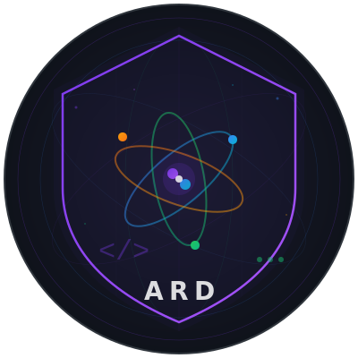

  

# 👋 Hi, I'm Adbhut Ram Das

**MSc Cybersecurity (Distinction) | Post-Quantum Cryptography Researcher | Security Tooling Engineer**

I'm a cybersecurity researcher focused on **post-quantum cryptography migration, quantum-resistant protocol security, and practical security tooling**. I recently completed my MSc in Cybersecurity with Distinction at the University of West London, where my thesis investigated **Mixed Quantum Computing and Cybersecurity: Post-Quantum Cryptography Readiness**.

🎯 **Goal:** PhD position in the Netherlands cybersecurity ecosystem

---

## 🔬 Research Focus

| Area | What I'm Working On |
|------|-------------------|
| **Post-Quantum Cryptography** | Migration readiness tools, NIST PQC standards (FIPS 203-205) |
| **Quantum Algorithm Security** | Shor's & Grover's algorithm impact on classical crypto |
| **Side-Channel Analysis** | Timing attacks on PQC implementations (PQ-HINTS methodology) |
| **Security Automation** | Recon engines, vulnerability reporting, bug bounty tooling |

## ⚛️ Featured Project: PQC Security Analyzer

A comprehensive research toolkit that:
- 🔍 **Scans codebases** for classical crypto (RSA, ECC, DH, DSA) — quantum-vulnerable algorithms
- ⚛️ **Assesses quantum risk** using Shor (1994) & Grover (1996) with NIST PQC severity classification
- ⏱️ **Tests PQC implementations** for timing side-channel leaks (CV statistical analysis)
- 📊 **Generates professional HTML/Markdown reports** for research documentation

**Zero external dependencies.** Pure Python stdlib.
→ `python3 main.py --self-test`

---

## 🛠️ Other Projects

| Project | Description |
|---------|-------------|
| [🔍 BugFlow](https://github.com/adbhutrd/bugflow) | Multi-phase bug bounty automation pipeline — recon through reporting |
| [🛡️ SiteGuard](https://github.com/adbhutrd/siteguard) | Automated security scanner with CI/CD integration |
| [💰 FTMO Tracker](https://github.com/adbhutrd/FTMO-challenge-TRacker) | Real-time FTMO challenge tracking with cloud sync |
| [🌐 Expense Tracker](https://github.com/adbhutrd/expense-tracker) | Daily expense tracker web app |

---

## 🎓 Academic Background

- **MSc Cybersecurity (Distinction)** — University of West London, Dec 2025
- **Thesis:** Mixed Quantum Computing and Cybersecurity: Post-Quantum Cryptography Readiness
  - NIST PQC standardization analysis (FIPS 203-205)
  - Lattice-based cryptography implementation evaluation
  - Organizational PQC migration strategy framework
- **BSc Computer Science** — Related undergraduate background

---

## 📫 Connect

- ✉️ adbhutramdas@gmail.com
- 💻 GitHub: [adbhutrd](https://github.com/adbhutrd)
- 📝 Medium: [@anonwiz8](https://medium.com/@anonwiz8)
- 📍 London, UK → 🇳🇱 Targeting Netherlands

---

*"The only way to deal with a quantum threat is to prepare for it before it arrives."*
